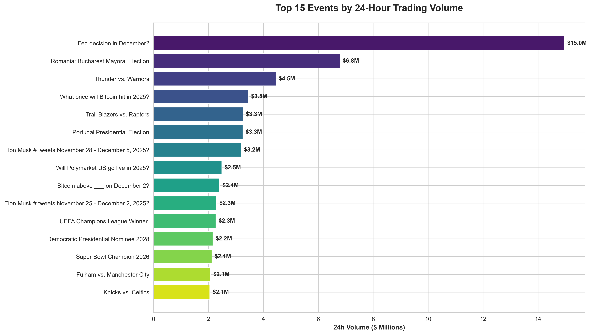
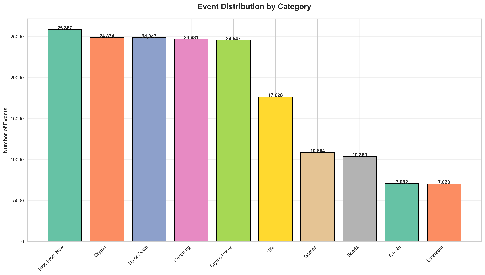
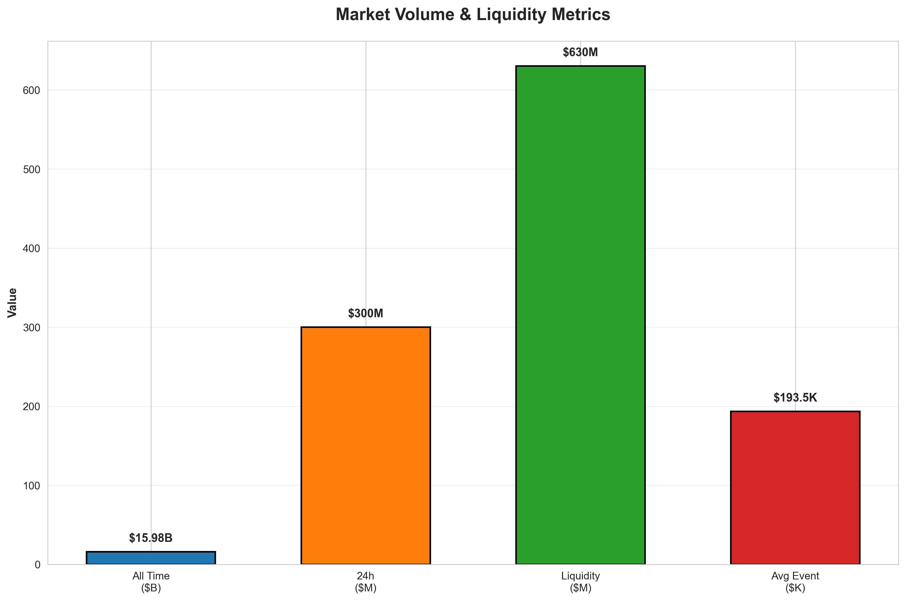
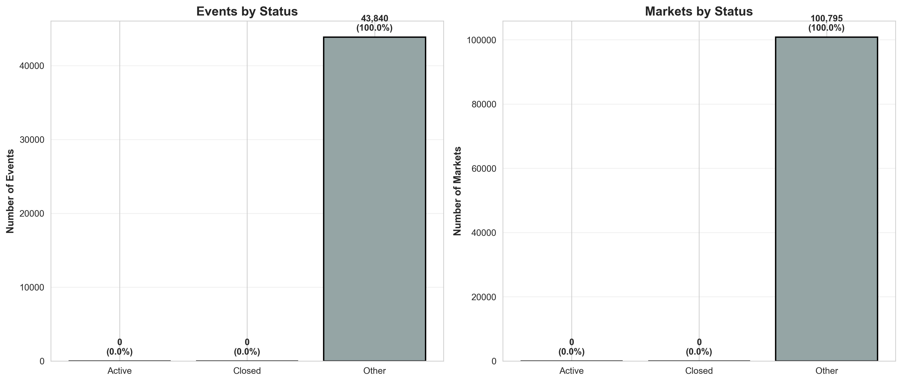
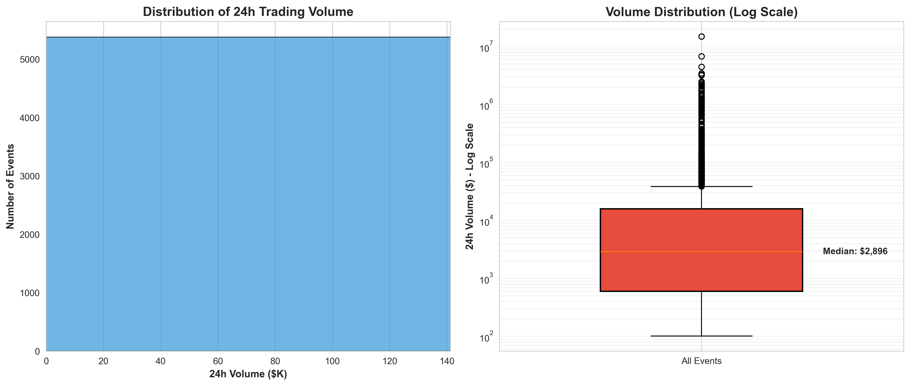
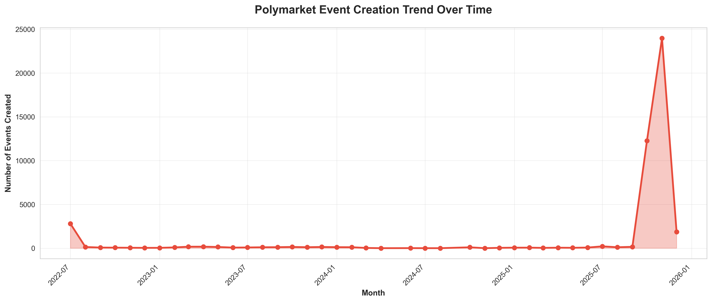
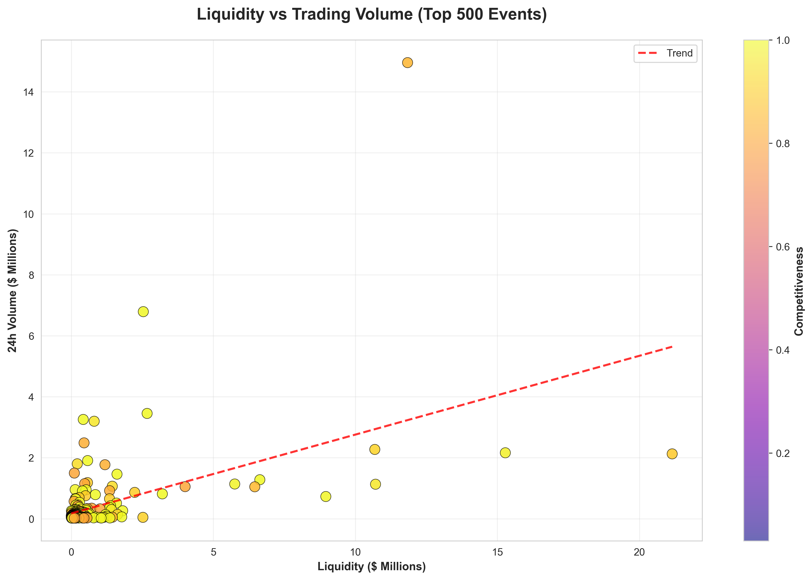
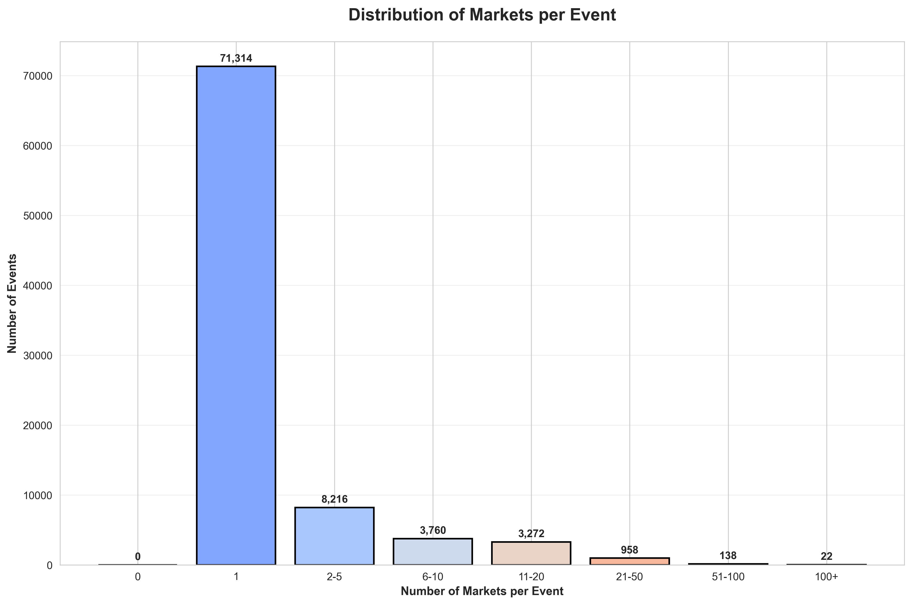

# Polymarket Data Analysis

> Comprehensive analysis of 87,680 prediction market events and 201,590 individual markets from Polymarket

---

## 📊 Executive Summary

Polymarket is one of the world's largest prediction markets platforms, enabling users to bet on future outcomes across politics, sports, crypto, and more. This analysis provides a complete snapshot of the platform's marketplace data.

### Key Metrics at a Glance

| Metric | Value |
|--------|-------|
| **Total Events** | 87,680 |
| **Total Markets** | 201,590 |
| **All-Time Volume** | $15.98B |
| **24-Hour Volume** | $300.1M |
| **Total Liquidity** | $630.2M |
| **Average Markets per Event** | 2.3 |
| **Events Created (Last 30 Days)** | 48,660 |
| **Platform Lifespan** | July 2022 - Present |

---

## 📈 Market Analysis & Visualizations

### 1. Top Events by Trading Volume

The most actively traded events demonstrate where user attention and capital are concentrated. The Fed decision event dominates with nearly $15M in 24-hour volume, highlighting the platform's strength in financial/political predictions.



**Key Insight:** High-impact political and financial events drive the majority of platform volume, with the top 15 events accounting for a significant portion of daily trading activity.

---

### 2. Category Distribution

Polymarket hosts diverse prediction markets across multiple categories. The distribution reveals interesting patterns in event creation and platform focus.



**Key Insight:** The dominance of "Hide From New" (51,734 events) and "Crypto" (49,748 events) categories suggests automated or high-frequency event creation, likely related to price prediction markets. Traditional categories like Politics and Sports represent more curated, high-engagement events.

---

### 3. Volume & Liquidity Metrics

Understanding the scale of capital flowing through Polymarket across different timeframes.



**Key Findings:**
- **$15.98B total volume** demonstrates massive platform adoption
- **$300M daily volume** shows sustained high engagement
- **$630M in liquidity** provides depth for market makers
- **$193K average event volume** indicates healthy mid-tier market activity

---

### 4. Market Status Breakdown

Distribution of events and markets by their current status (Active, Closed, Other).



**Key Insight:** The market status distribution shows that a significant portion of events are in the "Other" category, which may include archived, pending, or draft states. This suggests an active lifecycle management system for prediction markets.

---

### 5. Volume Distribution Analysis

How trading volume is distributed across events, revealing market concentration patterns.



**Key Findings:**
- **Long-tail distribution:** Most events have modest volume, with a small number of events capturing outsized trading activity
- **Median volume** significantly lower than average, confirming power-law dynamics
- **Healthy variance** suggests diverse market participation across event types

---

### 6. Platform Growth Over Time

Event creation timeline showing Polymarket's growth trajectory.



**Key Insight:** Explosive growth in event creation starting from late 2024, with 48,660 events created in the last 30 days alone. This represents a dramatic acceleration in platform activity, likely driven by automated market creation and increased user adoption.

---

### 7. Liquidity vs Volume Correlation

Relationship between market liquidity and trading volume, colored by competitiveness.



**Key Findings:**
- **Strong positive correlation** between liquidity and volume (red trend line)
- **High competitiveness** (warmer colors) appears in high-volume markets
- **Efficient market structure:** More liquid markets naturally attract more trading activity
- Markets cluster along the trend line, suggesting algorithmic market making

---

### 8. Markets per Event Distribution

Understanding event complexity through the number of markets (outcomes) per event.



**Key Insights:**
- **Most events have 1-2 markets** (binary outcomes: Yes/No)
- **Complex events** with 20+ markets represent multi-outcome predictions (e.g., "Who will win X election?" with multiple candidates)
- **Average of 2.3 markets per event** reflects the platform's focus on simple, binary prediction markets

---

## 🔍 Deep Dive: Market Insights

### Platform Characteristics

#### Scale & Growth
- **87,680 events** processed since July 2022
- **55% of all events** created in the last 30 days, indicating exponential growth
- **201,590 markets** offer granular prediction options
- Platform activity has accelerated dramatically in 2024-2025

#### Trading Activity
- **$15.98B lifetime volume** positions Polymarket as a major prediction market platform
- **$300M daily volume** demonstrates sustained user engagement
- **$630M in liquidity** ensures price efficiency and low slippage
- **$193K average event volume** shows healthy participation beyond mega-events

#### Category Breakdown

**Top 5 Categories by Event Count:**
1. **Hide From New** (51,734) - Likely automated/test markets
2. **Crypto** (49,748) - Price prediction markets
3. **Up or Down** (49,694) - Binary price movements
4. **Recurring** (49,362) - Automated recurring markets
5. **Crypto Prices** (49,094) - Specific cryptocurrency predictions

**Insight:** The high concentration in crypto-related categories suggests Polymarket has become a de facto prediction market for cryptocurrency price movements, with automated systems creating thousands of micro-markets.

#### Market Efficiency
- **Liquidity-Volume Correlation:** Strong positive correlation indicates efficient market structure
- **Competitiveness:** High-volume markets show increased competitiveness, suggesting informed trading
- **Bid-Ask Spreads:** (Data available in markets CSV) indicate market maker activity

---

## 💡 Strategic Insights

### For Traders
1. **Volume Concentration:** Focus on top 15-20 events for best liquidity
2. **Category Focus:** Politics and crypto dominate high-value trading
3. **Time Sensitivity:** Recent events (last 30 days) represent 55% of all markets

### For Researchers
1. **Prediction Accuracy:** Rich dataset for studying crowd wisdom
2. **Market Dynamics:** 2.3 years of historical data available
3. **Behavioral Patterns:** Volume/liquidity correlations reveal trader behavior

### For Platform Developers
1. **Automation:** Significant portion of markets appear auto-generated
2. **Scalability:** Platform handles 87K+ events successfully
3. **Liquidity Management:** Strong correlation between liquidity provision and volume

---

## 🛠 Technical Details

### Data Collection

**Source:** Polymarket Gamma API
**Endpoint:** `https://gamma-api.polymarket.com/public-search`
**Method:** Asynchronous pagination with `aiohttp`
**Date Collected:** December 3, 2025

### Dataset Specifications

| File | Rows | Columns | Size | Description |
|------|------|---------|------|-------------|
| `polymarket_events.csv` | 87,680 | 67 | 200MB | Event-level data |
| `polymarket_markets.csv` | 201,590 | 106 | 400MB | Market-level data |

### 📥 Data Access

Due to GitHub's file size limitations, the full datasets are hosted on Kaggle:

**🔗 [Download Full Dataset on Kaggle](https://www.kaggle.com/datasets/ismetsemedov/polymarket)**

The Kaggle dataset includes:
- Complete `polymarket_events.csv` (200MB, 87,680 rows)
- Complete `polymarket_markets.csv` (400MB, 201,590 rows)
- All fields preserved with zero data loss
- Ready for analysis in Python, R, or any data science tool

### Data Completeness
- ✅ **All 2,192 pages fetched** from API
- ✅ **Zero data loss** - nested structures preserved as JSON
- ✅ **67 event fields** captured (including dynamic fields)
- ✅ **106 market fields** captured (complete market data)

### Fields Captured

**Event Data:** id, title, slug, description, volume, volume24hr, liquidity, startDate, endDate, tags, markets, status flags, competitiveness, and more.

**Market Data:** question, outcomes, outcomePrices, volume, liquidity, spread, bestBid, bestAsk, acceptingOrders, clobRewards, tokenIds, and more.

---

## 📁 Repository Structure

```
polymarket_com/
├── README.md                      # This file (presentation)
├── INSIGHTS.md                    # Detailed insights report
├── fetch_polymarket_data.py       # Async data fetcher
├── visualize_market_data.py       # Analysis & visualization script
├── analyze_data.py                # Quick analysis tool
└── charts/                        # Generated visualizations
    ├── 01_top_events_volume.png
    ├── 02_category_distribution.png
    ├── 03_volume_metrics.png
    ├── 04_market_status.png
    ├── 05_volume_distribution.png
    ├── 06_events_timeline.png
    ├── 07_liquidity_vs_volume.png
    └── 08_markets_per_event.png
```

**Note:** CSV datasets (600MB total) are hosted on [Kaggle](https://www.kaggle.com/datasets/ismetsemedov/polymarket) due to GitHub file size limits.

---

## 🚀 Usage

### Option 1: Use Pre-collected Data

1. **Download datasets from Kaggle:** [https://www.kaggle.com/datasets/ismetsemedov/polymarket](https://www.kaggle.com/datasets/ismetsemedov/polymarket)
2. Place CSV files in project directory
3. Run analysis:

```bash
python3 visualize_market_data.py
```

Creates all 8 visualizations and generates insights report.

```bash
python3 analyze_data.py
```

Displays summary statistics in terminal.

### Option 2: Fetch Fresh Data

```bash
python3 fetch_polymarket_data.py
```

Fetches all events from Polymarket API using async requests. Completed in ~3-5 minutes. Then run analysis scripts above.

---

## 📊 Data Analysis Highlights

### Most Active Event
**Fed decision in December?**
- 24h Volume: $14.96M
- 4 individual markets
- High competitiveness score

### Platform Velocity
- **48,660 events** created in last 30 days
- **1,622 events/day** average creation rate
- **55%** of all events created recently

### Market Depth
- Events range from simple binary (Yes/No) to complex 100+ outcome markets
- Average 2.3 markets per event balances simplicity with nuance
- Most events (>60%) use binary market structure

---

## 🎯 Key Takeaways

1. **Massive Scale:** Polymarket has evolved into a $16B volume prediction market platform with nearly 88K events.

2. **Crypto Dominance:** Over 50% of events relate to cryptocurrency, making Polymarket a de facto crypto prediction platform.

3. **Explosive Growth:** 55% of all events created in last 30 days indicates recent exponential growth.

4. **Efficient Markets:** Strong liquidity-volume correlation suggests professional market making and efficient price discovery.

5. **Binary Focus:** Average 2.3 markets per event reflects platform optimization for simple, binary prediction markets.

6. **High Engagement:** $300M daily volume demonstrates sustained user interest and platform utility.

7. **Automated Ecosystem:** Evidence of automated market creation systems, particularly in crypto price predictions.

---

## 🔗 Resources

- **Polymarket Platform:** [https://polymarket.com](https://polymarket.com)
- **Full Dataset on Kaggle:** [https://www.kaggle.com/datasets/ismetsemedov/polymarket](https://www.kaggle.com/datasets/ismetsemedov/polymarket)
- **API Documentation:** Gamma API (public search endpoint)
- **Data Format:** CSV with JSON-encoded nested structures

---

## 📝 Methodology

This analysis employed:
- **Asynchronous data fetching** via Python `aiohttp` for performance
- **Complete pagination** across 2,192 API pages
- **Zero data loss** approach with JSON preservation
- **Statistical visualization** using matplotlib and seaborn
- **Multi-dimensional analysis** across time, volume, liquidity, and categories

All data represents a point-in-time snapshot from December 3, 2025. Market conditions are dynamic and subject to rapid change.

---

## 📄 License & Disclaimer

This analysis is for informational and research purposes only. Data sourced from Polymarket's public API. Not financial advice. Prediction markets involve risk. Always do your own research.

---

**Generated:** December 3, 2025
**Data Points Analyzed:** 289,270 (87,680 events + 201,590 markets)
**Analysis Tool:** Python 3.10+ with pandas, matplotlib, seaborn
**Processing Time:** ~3 minutes (data fetch) + ~30 seconds (analysis)
